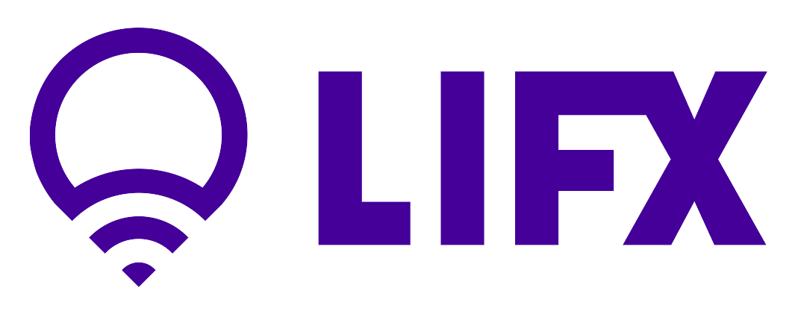

# ioBroker.lifx
=================

Lifx adapter for ioBroker

##Installation:
the official released version
- npm install iobroker.lifx

the actual version from github:
- npm install https://github.com/foxthefox/ioBroker.lifx/tarball/master --production

##Settings/Configuration:
- no settings or configuration required, adapter automatically detects the lamps
###metro widget unreachable status
- small icon for unreachable status in metro-widget is the first object of notification
- object_id[0] is the indicator.unreachable
- instead of presetting "true", "false" shall be written
- the icon should be wifiColorRed.png 
- horizontal offset of 6 should work fine

##Visualization:
- use lifx widgets

##TODO:
- cyclical getState from lamp, if adjusted outside ioBroker
- getting adjustment of color values with all existing settings (brighness adjust has fixed 80% saturation and keeps the previous hue setting; saturation adjust and hue adjust has fixed 80% brightness)
- transition times
- waveforms
- usage of meta.roles
- objects for white lamp

##known issues
- max setting is 360 in vis dialog, does not take over the presetting of 100
- color images for slider to be mapped to lifx

##Changelog:

###0.0.3
- metro widget
- jqui widget

###0.0.2 
- change to node-lifx
- successful tested with 2 lamps and firmware 2.1

###0.0.1 
- initial setup with lifx
